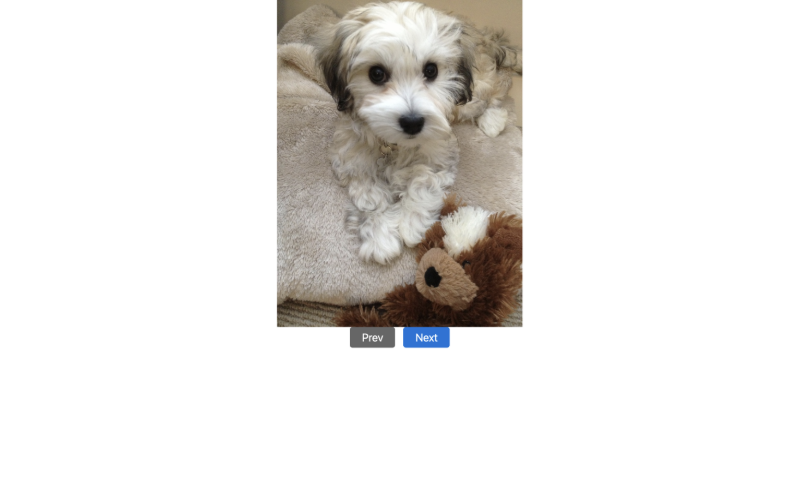

# Frontend Master Bootcamp: Gallery Project

## Introduction

This project is part 1 of the "Using JavaScript in Websites" course from the Frontend Masters Bootcamp. It focuses on creating an interactive image gallery using HTML, CSS, and JavaScript. This was a great way to revisit the basics of JavaScript along with HTML and CSS.

In part 2, we implement Swiper and GSAP libraries to enhance this gallery. You can find Part 2 [here](https://github.com/tak40/fm-bootcamp-interactive-gallery2).



## Live Site

You can view the live version of the project [here](https://frontend-masters-image-gallery.netlify.app/)

## Features

- **HTML and CSS**: Utilizes HTML for structure and CSS for styling the image gallery.
- **JavaScript**: Implements functionality to navigate through the gallery images using "Prev" and "Next" buttons.

## Personal Learnings

While working on this project, I revisited and found several concepts interesting and important:

- **HTML and CSS Basics**: Reinforced the basics of structuring an HTML document and applying CSS styles.
- **JavaScript DOM Manipulation**: Learned how to use JavaScript to interact with the DOM, including adding and removing classes to show and hide elements.
- **Event Handling**: Implemented event listeners to handle user interactions with the gallery controls.

## Acknowledgements

This project is part of the Frontend Masters Bootcamp, specifically focusing on HTML, CSS, and JavaScript lessons. Special thanks to the instructors for providing valuable lessons and resources. Learn more at [Frontend Masters Bootcamp](https://frontendmasters.com/bootcamp/) and [Using JavaScript in Websites](https://frontendmasters.com/bootcamp/javascript-in-websites/).

## Getting Started

To get started with this project, clone the repository and open the `index.html` file in your browser.

```sh
git clone https://github.com/tak40/fm-bootcamp-interactive.git
cd fm-bootcamp-interactive
open index.html
```
